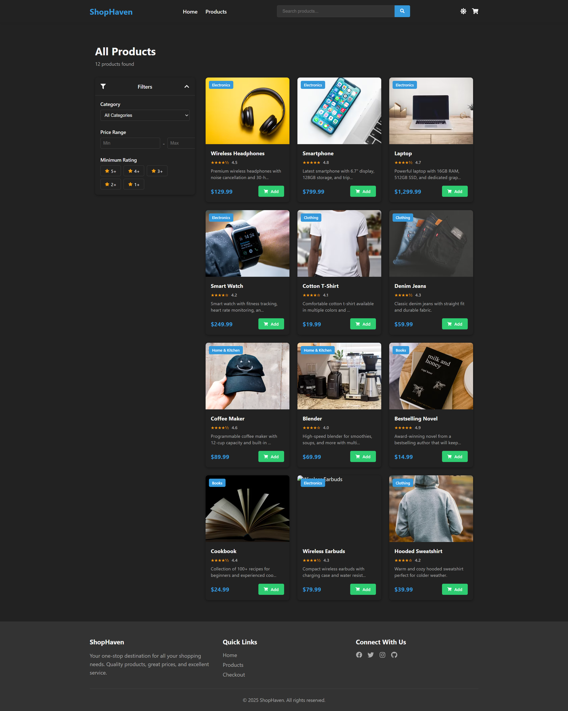
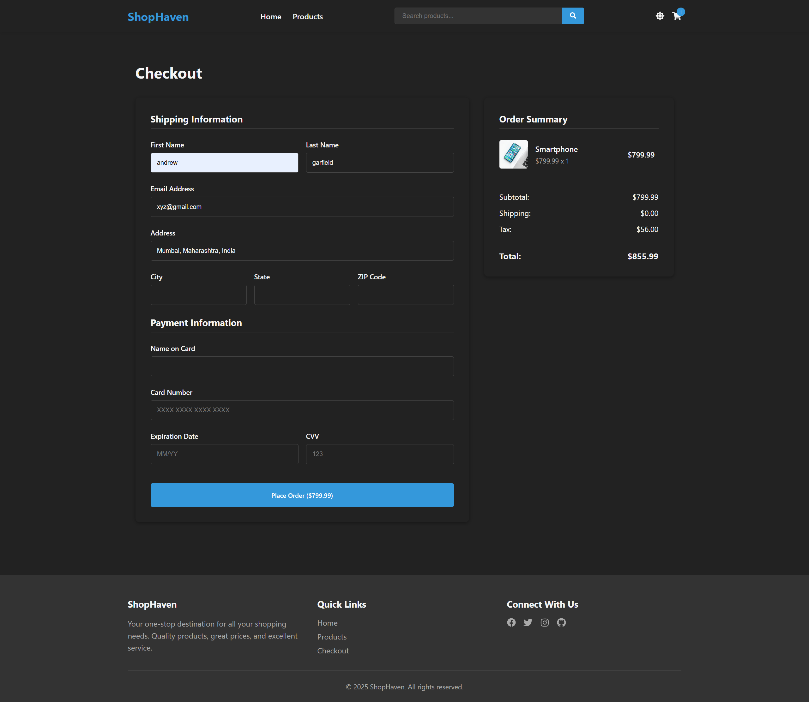

# ShopHaven E-commerce Website

A modern e-commerce platform built with a sleek dark theme offering electronics, clothing, books, and home & kitchen products.

## Screenshots

### Home Page

### Home Page (Light Mode)

### Products Page

### Product Details

### Checkout Page

## Features

- Clean and modern user interface with dark theme
- Product categorization
- Featured products section
- Summer sale promotions
- Shopping cart functionality
- Secure checkout process
- Responsive design
- Search functionality
- User account management

## Benefits

- Free Shipping on orders over $50
- Fast Delivery within 2-3 business days
- 30-day Easy Return policy
- Secure Payment processing

## Technologies Used

- HTML
- CSS
- JavaScript
- React
- TypeScript

## License

© 2025 ShopHaven. All rights reserved.
